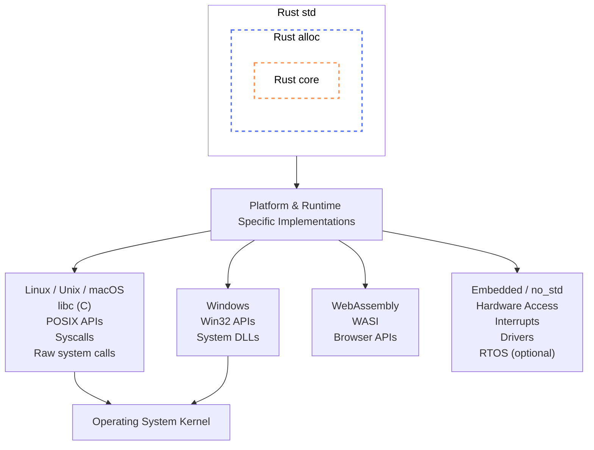

```mermaid
flowchart TB

    subgraph STD[Rust std]
        direction TB

        subgraph ALLOC[Rust alloc]
            direction TB
            CORE[Rust core]
        end
    end

    STD --> PLATFORM

    PLATFORM["Platform & Runtime Specific Implementations"]

    PLATFORM --> UNIX
    PLATFORM --> WINDOWS
    PLATFORM --> WASM
    PLATFORM --> EMBEDDED

    UNIX["Linux / Unix / macOS<br/>libc (C)<br/>POSIX APIs<br/>Syscalls<br/>Raw system calls"]
    WINDOWS["Windows<br/>Win32 APIs<br/>System DLLs"]
    WASM["WebAssembly<br/>WASI<br/>Browser APIs"]
    EMBEDDED["Embedded / no_std<br/>Hardware Access<br/>Interrupts<br/>Drivers<br/>RTOS (optional)"]

    UNIX --> KERNEL
    WINDOWS --> KERNEL

    KERNEL["Operating System Kernel"]
	style STD color:#000000,stroke:#5E17EB,stroke-width:0.5px,fill:#FFFFFF
	style CORE color:#000000,stroke-width:2px,stroke-dasharray:5 5,fill:#FFFFFF,stroke:#FF914D
	style ALLOC color:#000000,stroke-width:2px,stroke-dasharray:5 5,fill:#FFFFFF,stroke:#5271FF
```