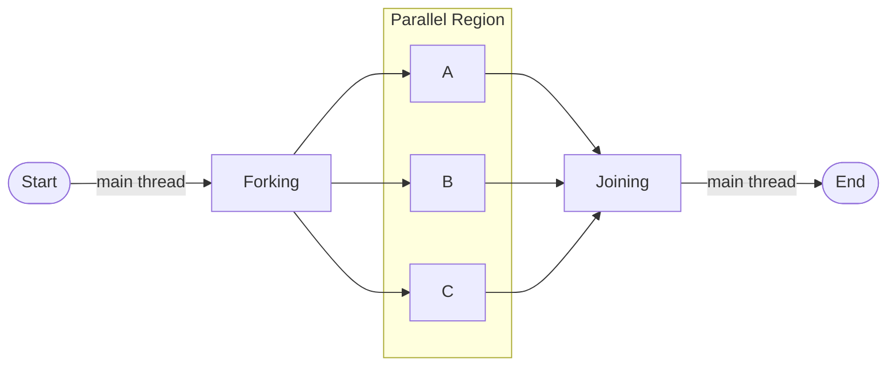
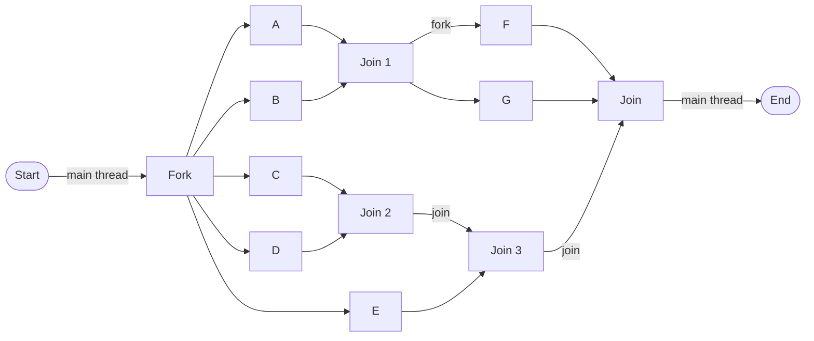

```mermaid
flowchart LR
    Start([Start]) -->|main thread| Forking[Forking]
    subgraph Parallel["Parallel Region"]
        direction LR
        A[A]
        B[B]
        C[C]
    end
    Forking --> A
    Forking --> B
    Forking --> C
    A --> Joining[Joining]
    B --> Joining
    C --> Joining
    Joining -->|main thread| EndNode([End])
```

```mermaid
flowchart LR
    Start([Start]) -->|main thread| Fork[Fork]

    Fork --> A[A]
    Fork --> B[B]
    Fork --> C[C]
    Fork --> D[D]
    Fork --> E[E]

    A --> Join1[Join 1]
    B --> Join1

    Join1 -->|fork| F[F]
    Join1 --> G[G]

    F --> Join[Join]
    G --> Join
    Join3 -->|join| Join

    C --> Join2[Join 2]
    D --> Join2

    Join2 -->|join| Join3[Join 3]
    E --> Join3

    Join -->|main thread| EndNode([End])
```