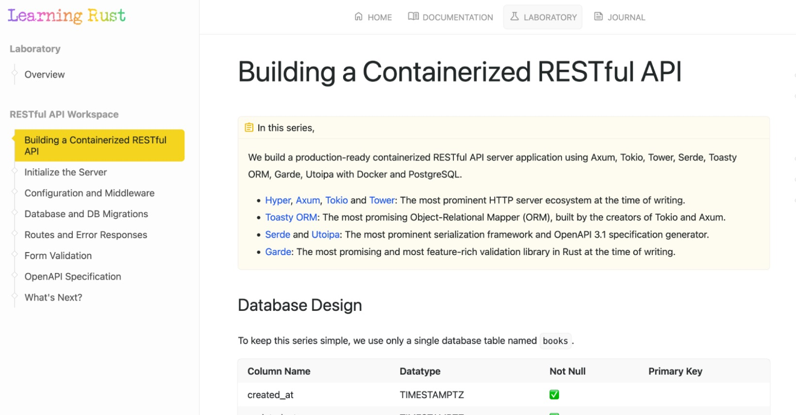
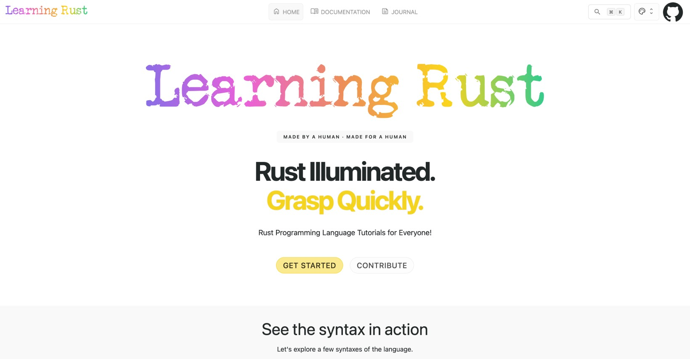
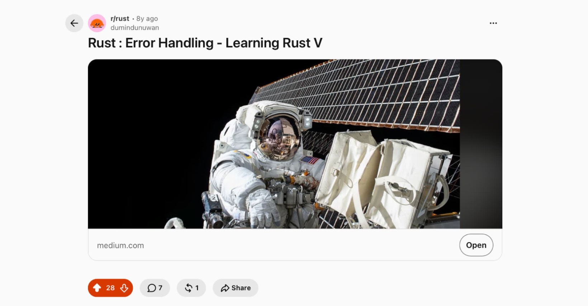
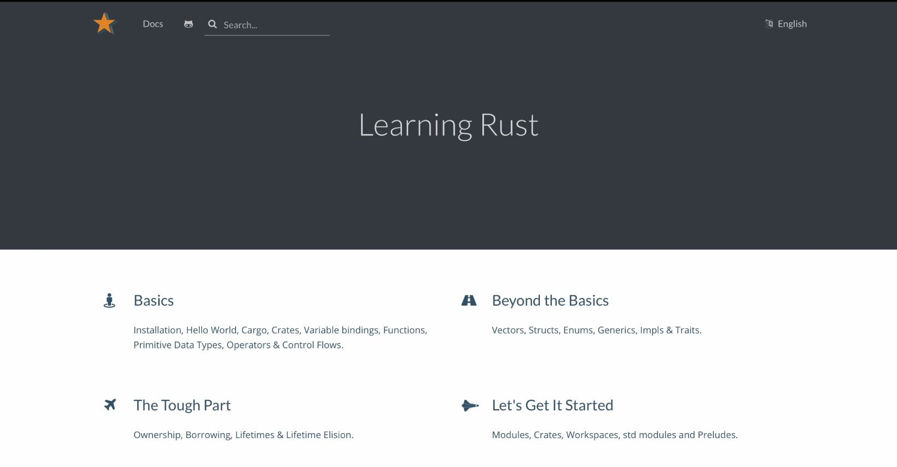
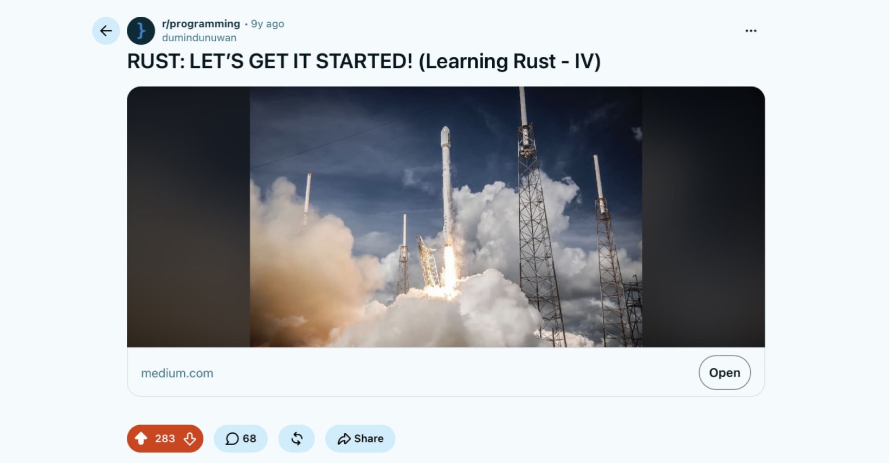
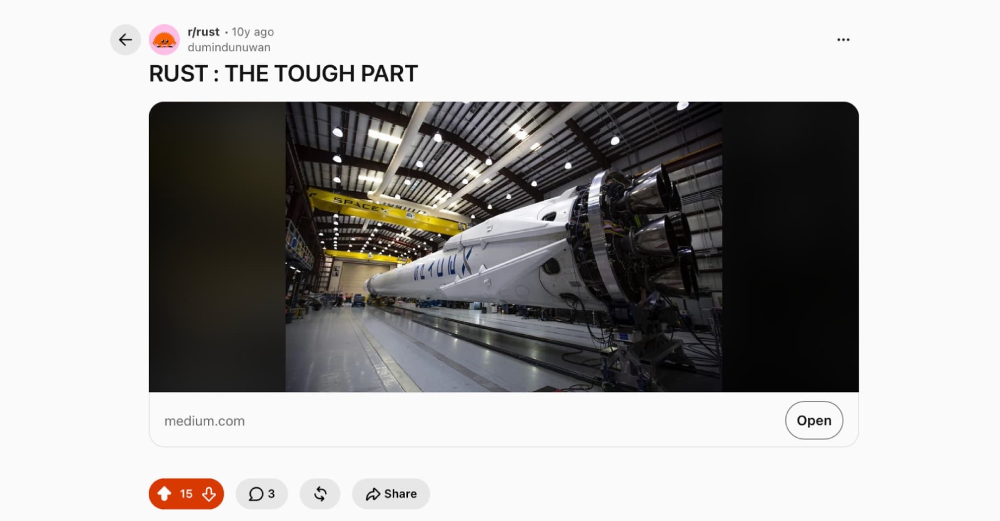
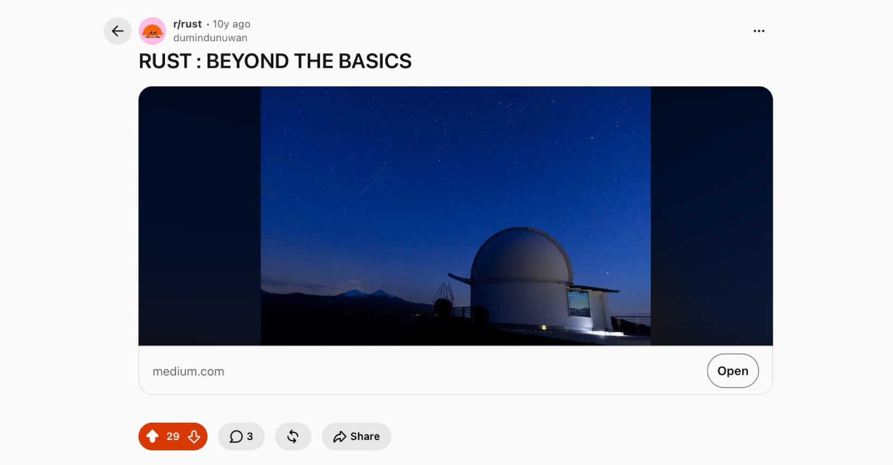
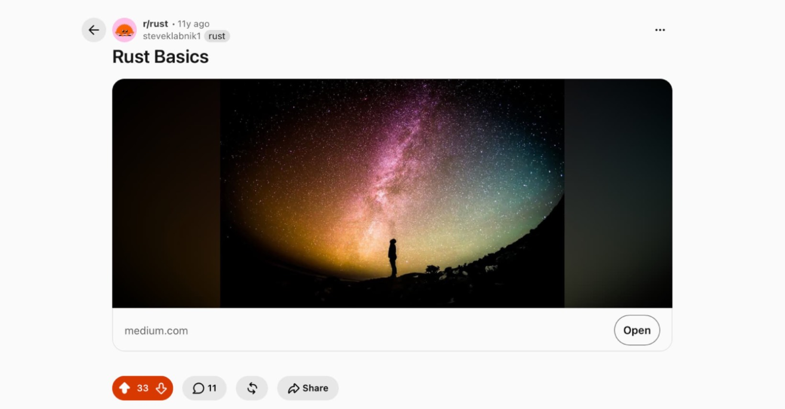

## 2026: August 18

> 
> - Added long-awaited "Learning Rust - Laboratory" with its first project, RESTful API Workspace.
> - [Reddit: r/rust](https://www.reddit.com/r/rust/comments/1vrfuve/learningrustgithubio_labs_project_1_restful_api/)

## 2026: August 03

> 
> - Updated section by section for quite some time now.
> - Based on my own [e25DX](https://dumindu.github.io/E25DX/) theme, since 2024.
> - [Reddit: r/rust](https://www.reddit.com/r/rust/comments/1venj1y/learning_rust_updated_humanauthored_from_2016/)
> - [Hacker News](https://news.ycombinator.com/item?id=49166411)

---

## 2018: December 07

> 
> - [Medium](https://medium.com/learning-rust/rust-error-handling-72a8e036dd3)
> - [Reddit: r/rust](https://www.reddit.com/r/rust/comments/a3r6q1/rust_error_handling_learning_rust_v/)

---

## 2018: January 01

> 
> - Based on the [navy theme](https://github.com/hexojs/site/tree/master/themes/navy) of [Hexo](https://hexo.io/) docs.
> - [Internet Archive](https://web.archive.org/web/20180000000000*/https://learning-rust.github.io/)
> - [Hacker News: March 15](https://news.ycombinator.com/item?id=16594547)
> - [Reddit: r/rust: August 18](https://www.reddit.com/r/rust/comments/984ai3/learning_rust_a_lean_approach/)

---

## 2017: December 04
> 
> - [Medium](https://medium.com/learning-rust/rust-lets-get-it-started-bdd8de58178d)
> - [Reddit: r/rust](https://www.reddit.com/r/rust/comments/7hd6o1/rust_lets_get_it_started/)
> - [Reddit: r/programming](https://www.reddit.com/r/programming/comments/7hd6cr/rust_lets_get_it_started_learning_rust_iv/)

---

## 2017: January 01

> 
> - [Medium](https://medium.com/learning-rust/rust-the-tough-part-2ea11ed3693e)
> - [Reddit: r/rust](https://www.reddit.com/r/rust/comments/5lelo2/rust_the_tough_part/)

---

## 2016: August 01

> 
> - [Medium](https://medium.com/learning-rust/rust-beyond-the-basics-4fc697e3bf4f)
> - [Reddit: r/rust](https://www.reddit.com/r/rust/comments/4voajy/rust_beyond_the_basics/)

---

## 2016: January 24

> 
> - [Medium](https://medium.com/learning-rust/rust-basics-e73304ab35c7)
> - [Reddit: r/programming](https://www.reddit.com/r/programming/comments/42ieeu/rust_basics/). And luckily Steve Klabnik crossposted it in [Reddit: r/rust](https://www.reddit.com/r/rust/comments/42ipwu/rust_basics/).