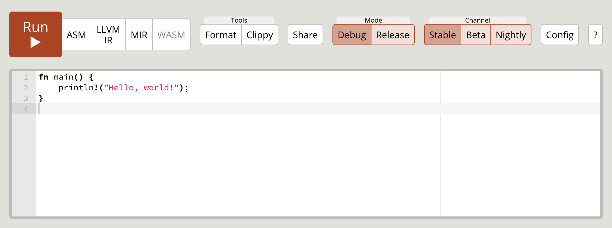

title: Hello World
---

## Hello, World!
```rust
fn main() {
    println!("Hello, world!");
}
```

`fn` means function. The `main` function is the beginning of every Rust program.  
`println!` prints text to the console and its *!* indicates that it’s a [macro](https://doc.rust-lang.org/book/first-edition/macros.html) rather than a function.

> 💡 Rust files should have .rs file extension and if you’re using more than one word for the file name, follow the [snake_case](https://en.wikipedia.org/wiki/Snake_case).

- Save the above code in `file.rs` , but it can be any name with `.rs` extension.
- Compile it with `rustc file.rs`
- Execute it with `./file` on Linux and Mac or `file.exe` on Windows

## Rust Playground

[Rust Playground](https://play.rust-lang.org/) is a web interface for running Rust code.

[](https://play.rust-lang.org/)

## Usages of println!

💯 These are the other usages of the `println!` macro,

```rust
fn main() {
    println!("{}, {}!", "Hello", "world"); // Hello, world!
    println!("{0}, {1}!", "Hello", "world"); // Hello, world!
    println!("{greeting}, {name}!", greeting="Hello", name="world"); // Hello, world!

    println!("{:?}", [1,2,3]); // [1, 2, 3]
    println!("{:#?}", [1,2,3]);
    /*
        [
            1,
            2,
            3
        ]
    */

    // 🔎 The format! macro is used to store the formatted string.
    let x = format!("{}, {}!", "Hello", "world");
    println!("{}", x); // Hello, world!
}
```
